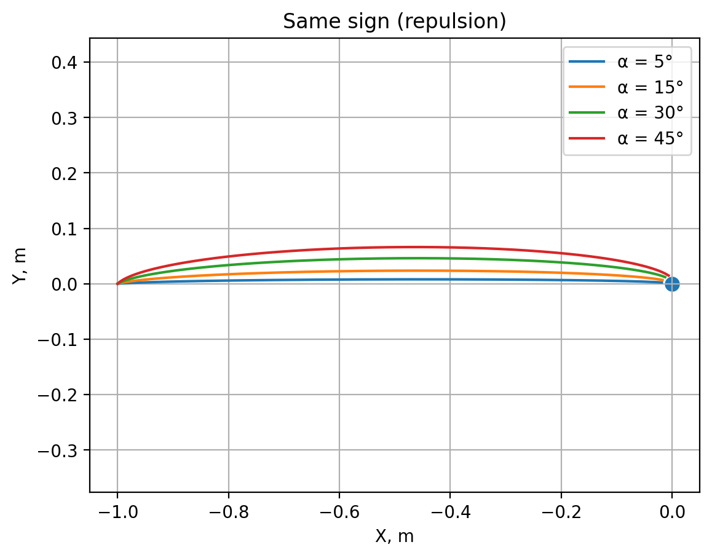
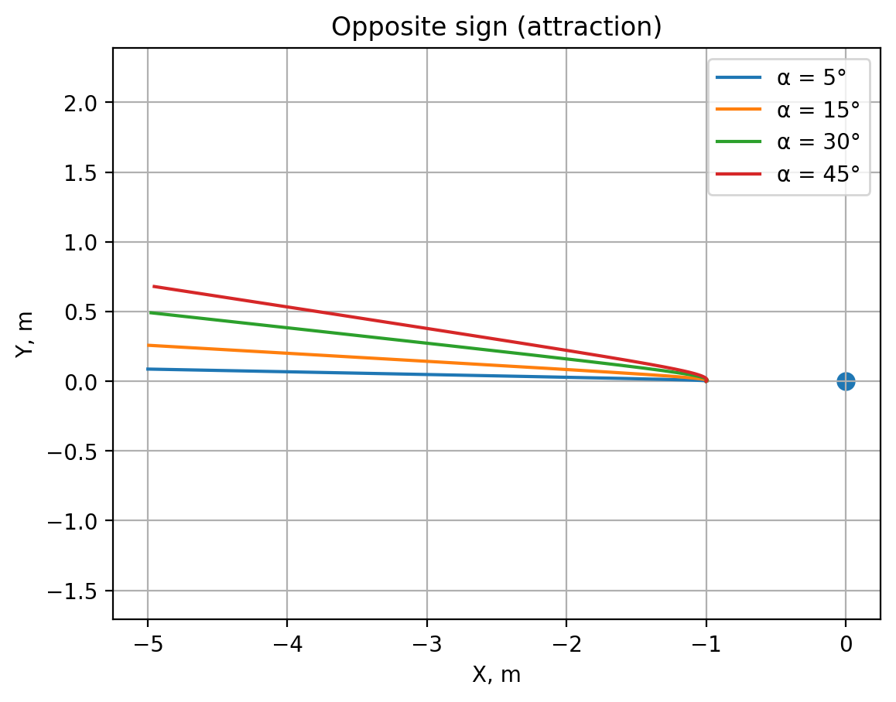
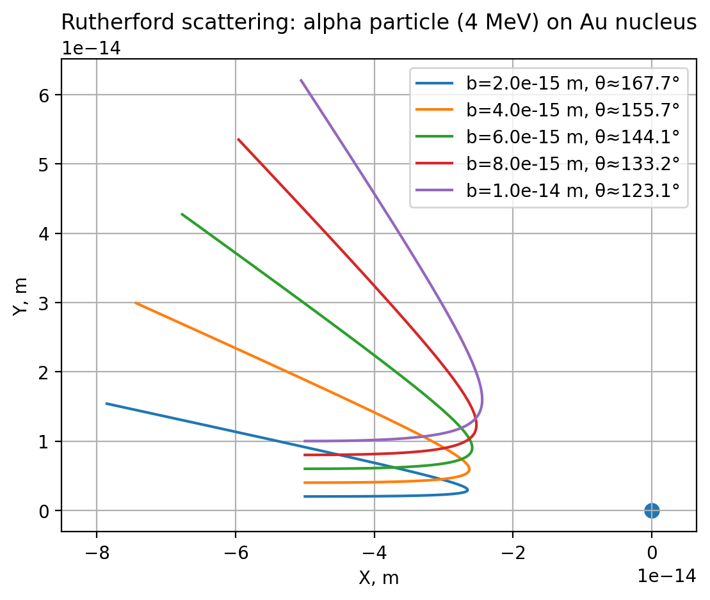

# Моделирование движения заряженной частицы в кулоновском поле

В данной работе выполнено численное моделирование движения заряженной частицы в кулоновском поле фиксированного точечного заряда, а также моделирование рассеяния Резерфорда для α-частицы на ядре золота.

Моделирование выполнено на языке Python с использованием стандартных численных методов решения дифференциальных уравнений.

---

## 1. Постановка задачи

Рассматривается движение частицы с зарядом q и массой m в кулоновском поле неподвижного заряда Q, расположенного в начале координат.

Движение частицы описывается вторым законом Ньютона с кулоновской силой взаимодействия. В работе рассмотрены два случая:
- заряды одного знака (отталкивание);
- заряды разных знаков (притяжение).

Также отдельно рассматривается задача рассеяния Резерфорда — отклонение α-частицы в кулоновском поле ядра золота.

---

## 2. Численная модель

### 2.1 Уравнения движения

Движение заряженной частицы описывается системой уравнений, вытекающей из второго закона Ньютона и закона Кулона (аналог формулы (6.6) из методического пособия).

Векторное уравнение движения имеет вид:

m · d²r/dt² = − Q · q · r / r³

где:
- r = (x, y) — радиус-вектор частицы относительно неподвижного заряда Q,
- r = sqrt(x² + y²),
- m — масса частицы,
- q — заряд движущейся частицы,
- Q — заряд источника поля.

Знак «минус» означает, что сила направлена вдоль радиус-вектора с учётом характера взаимодействия. Фактическое притяжение или отталкивание определяется знаком произведения Q·q.

---

### 2.2 Координатная форма уравнений

В координатной форме система уравнений записывается следующим образом:

m · dvx/dt = − Q · q · x / (x² + y²)^(3/2)  
m · dvy/dt = − Q · q · y / (x² + y²)^(3/2)  
dx/dt = vx  
dy/dt = vy  

Данная система полностью соответствует уравнениям движения, приведённым в методическом пособии.

---

### 2.3 Используемая форма уравнений в программе

В программной реализации ускорение частицы вычисляется по формуле:

a = − (Q · q / m) · r / r³

Радиус-вектор r направлен от неподвижного заряда Q, расположенного в начале координат, к движущейся частице.

Характер движения определяется знаком произведения Q·q:
- при Q·q > 0 реализуется отталкивание;
- при Q·q < 0 — притяжение.

Таким образом, используемые в программе уравнения полностью эквивалентны формулам из методического пособия, а различие в знаке связано с выбором направления радиус-вектора.

---

### 2.4 Безразмерная модель

В задаче движения частицы кулоновская постоянная принята равной единице. Это соответствует безразмерной модели и позволяет исследовать качественное поведение траекторий без привязки к конкретной системе единиц.

Такой подход является стандартным при учебном численном моделировании и используется в методическом пособии.

---

### 2.5 Численный метод решения

Система дифференциальных уравнений решается численно методом Рунге–Кутты 4-го порядка (RK4).

Интегрирование прекращается при:
- достижении малого расстояния до центрального заряда (во избежание сингулярности);
- удалении частицы на большое расстояние от источника поля.

---

### 2.6 Модель рассеяния Резерфорда

Для задачи рассеяния Резерфорда используется кулоновская сила в системе СИ:

F = (1 / (4πϵ₀)) · Q · q · r / r³

Рассматривается движение α-частицы с параметрами, заданными в условии задачи:
- заряд α-частицы q = 2e,
- заряд ядра золота Q = 79e,
- масса α-частицы m = 4 а.е.м.,
- кинетическая энергия E = 4 МэВ.

Начальное расстояние до ядра в численной модели выбрано больше, чем в методическом пособии. Это сделано исключительно для наглядной визуализации траекторий и не влияет на физический характер рассеяния.

Исследуется зависимость траектории и угла рассеяния от прицельного параметра b, что соответствует классической постановке эксперимента Резерфорда.

---

## 3. Структура проекта

В репозитории содержатся два основных файла с кодом.

### simulate_coulomb.py

Файл реализует численное моделирование движения заряженной частицы в кулоновском поле для различных начальных углов скорости.

Рассматриваются два случая:
- одинаковые знаки зарядов (отталкивание);
- разные знаки зарядов (притяжение).

Для каждого случая строятся траектории движения частицы при различных значениях угла α.

**Результаты моделирования:**

#### Отталкивание (одинаковые знаки зарядов)

#### Притяжение (разные знаки зарядов)

---

### rutherford_scattering.py

Файл реализует модель рассеяния Резерфорда для α-частицы в кулоновском поле ядра золота.

Исследуется зависимость траектории и угла рассеяния от прицельного параметра b.

**Результат моделирования рассеяния Резерфорда:**

---

## 4. Результаты и выводы

В результате численного моделирования показано, что:
- при одинаковых знаках зарядов частица отклоняется от центра поля;
- при разных знаках зарядов частица притягивается к центральному заряду;
- в задаче рассеяния Резерфорда уменьшение прицельного параметра приводит к увеличению угла рассеяния.

Полученные результаты качественно согласуются с теоретическими представлениями о движении заряженных частиц в кулоновском поле и экспериментом Резерфорда.

---

## 5. Используемые технологии

- Python 3
- NumPy
- Matplotlib
